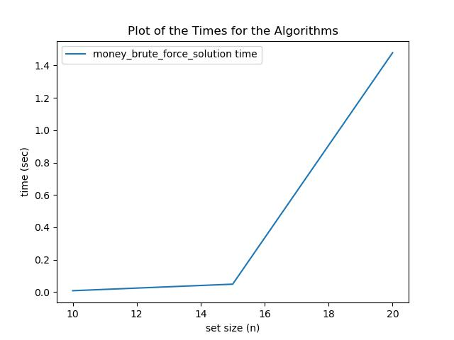
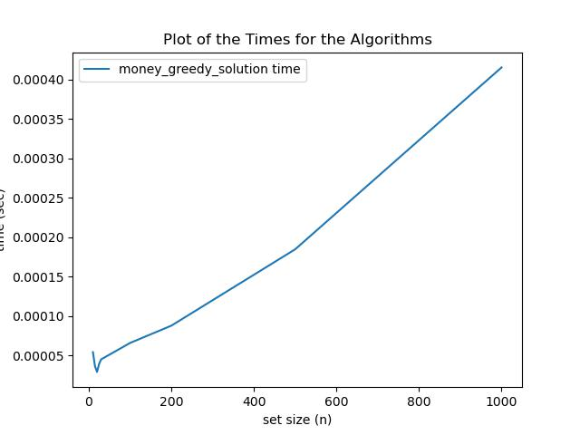
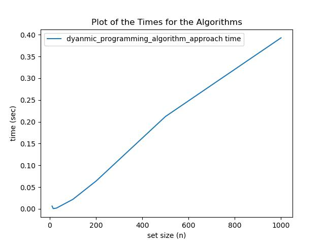
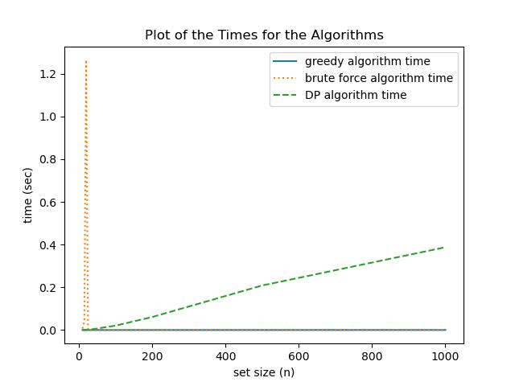

# COMP-257-Final-Project - Sean Malloy

This is the final project for COMP-257.
Here I will be implementing the Knapsack Problem solutions using Brute Force, a greedy algorithm, and a Dynamic Programming Algorithm.

## Table of Contents

* [Question](Question)
  * [inputs and outputs](#inputs-and-outputs)
  * [Data Creation](#data-creation)
* [Brute Force Approach](#brute-force-approach)
  * [Approach](#approach)
  * [PseudoCode](#pseudocode)
  * [Big Oh Analysis](#big-oh-analysis)
  * [Explanation of Missing Test Cases](#explanation-of-missing-test-cases)
* [Greedy Approach](#greedy-approach)
  * [Approach](#approach-1)
  * [PseudoCode](#pseudocode-1)
  * [Big Oh Analysis](#big-oh-analysis-1)
  * [Explanation of why greedy algorithm has a different solution](#explanation-of-why-greedy-algorithm-has-a-different-solution)
* [Dynamic Programming Approach](#dynamic-programming-approach)
  * [Approach](#approach-2)
  * [PseudoCode](#pseudocode-2)
  * [Big Oh Analysis](#big-oh-analysis-2)
* [Algorithm recommendation](#algorithm-recommendation)
* [Output of the code](#output-of-the-code)
* [References and Citations](#references-and-citations)

## Question

We have a knapsack problem in which we want to optimize the quality ratings we have for a list of grants that are requesting X amount of funds.
Given a certain amount of money, how would you find the subset of grants that maximize the sum of quality ratings while still being within budget.
In this problem, you would want to find what is the maximum quality that you can get from the grants that you were given.

### inputs and outputs

**Inputs**
*Proposals*: Dictionary of proposals
The dictionary would be structured as the following

``` python
proposals = [
  {"cost": 100, "quality": 2},
  {"cost": 20, "quality": 5},
  {"cost": 10, "quality": 10},
  ...
]
```

cost: The amount of money to fund a certain grant (cost >=0 )
quality: The amount of quality a grant will provide (float)

*Money*: Money available to fund grants (Money >=0 )

**Outputs**
*OutputSubset*: Subset of grants that maximize the quality rating
*OutputQuality*: Optimal quality score obtained
In the final implementation, only the OutputQuality was returned, however it wouldn't require much more work to find the OutputSubset if needed.

### Data Creation

I have utilized the 0-1Knapsack Dataset generator `generatorExecutable` from the Github Repository of JorikJooken to create 6 different knapsack sets.
This Github repository contains several datasets for the knapsack problem, as well as a knapsack problem dataset generator that I had utilized for my project. I have used this generator alongside the knapsack solver tool from Google mentioned below to create the datasets and answer sheet that I had used for this project.

The 6 problem sets that I have created are as follows:

``` psuedocode
Set 1
n = 10
W = 100

Set 2
n = 25
W = 200

Set 3
n = 100
W = 1000

Set 4
n = 200
W = 1500

Set 5
n = 500
W = 2000

Set 6
n = 1000
W = 3000

Set 7
n = 15
W = 150

Set 8
n = 20
W = 200

Set 9
n = 30
W = 300
```

The way to use the generator is as follows:

``` bash
./generatorExecutable < problem_generator_X.txt > problem_setN.txt
```

I have also utilized the knapsack solver created by Google as part of the Optimization packaged called `ortools` to produce the optimal results of the problem sets. This tool was able to take the dictionary I had created above for each dataset, and find the optimal solutions to each.

I have stored the generated datasets under the problems_set directory here: [Problems Set](./problems_set)
## Brute Force Approach

### Approach

The brute force approach to this problem would be one in which you iterate through each grant, and create a list of each permutation of subgroups of grants. Afterwards, you would go through each permutation, and check which subgroup would give you the highest quality rating without going over the available money(M).

#### PseudoCode

``` python
def money_brute_force_solution(Proposals, Money):
  subsets = []
  OQuality = 0
  OSubset = []
  # Get the powerset of the proposals
  if len(Proposals) == 0:
    return OSubset, Quality
  elif len(proposals) == 1:
    subsets.append(proposals[0])
  else:
    for i in range(len(Proposals)):
      # Get a list that is just i by itself
      subsets.append(proposals[i])
      for j in range(i+1, len(Proposals)):
        # Get a list that is evey permutation of i and everything after i
        # IE [1,2,3], [1,3]
        subset = proposals[i] + proposals[:k]
        subsets.append(subset)
  
  for i in range(len(subset)):
    sumCost = 0
    quality
    for grants in subset[i]:
      sumCost += grants["cost"]
      quality += grants["quality"] 
    if sumCost <= Money:
      if quality > OQuality:
        OQuality = quality
        OSubset = subset[i]
  return OSubset, OQuality

```

### Big Oh Analysis

This solution would be O(2<sup>N</sup>) + O(2<sup>N</sup>), where N is len(proposals)

* O(2<sup>N</sup>) coming from creating the subsets (From creating each permutation of subset from the superset, similar as going through the whole binary counting system of 000, 001, 010, etc)
* O(2<sup>N</sup>) coming from going though the final for-loop of all the permutations to get the answer. Being that there are 2<sup>N</sup> subsets created, going through all of them should take O(2<sup>N</sup>) time

So in this example, the Big-Oh of the solution would be O(2 \* 2<sup>N</sup>) since 2 is a constant, we can get rid of it.
Answer: O(2<sup>N</sup>)

From running the algorithm, we have seen the Brute Force Algorithm has a runtime curve that looks like this. It drops off immediately after the third problem to 0:


### Explanation of Missing Test Cases

This approach takes up a large amount of memory, so when I test this, that became an issue, in which my computer would run out of system memory and cause the program to crash. I had setup 3 test cases for this algorithm to run on, but otherwise it was not able to run for the other datasets as it would crash with and O(2<sup>N</sup>) memory increase each time.

## Greedy Approach

### Approach

One greedy Approach would be to assign the largest quality score available for the subset, and go from there
Another Greedy Approach would be to assign the lowest cost grants first to try to maximize the amount of grants we can manage
My proposed Greed Approach would be to sort the array by both costs and quality, and assign the subtasks accordingly to the list. This would be a combination of the two rules above, in which we take in the tasks with the highest quality, and that are lowest cost.
The reason I propose this approach, is if we have multiple grants with the same costs, we would want to take in the ones with the lowest costs first, in case if we can, then keep going down the list until we have no more money to spend

#### PseudoCode

``` python
def money_greedy_solution(Proposals, Money):
  # First I will be sorting the algorithm by both quality then cost. This if optmized should take around O(2logN) time
  Proposals = sorted(sorted(Proposals, key = lambda x : x["cost"]), key = lambda x : x["quality"], reverse = True)
  i = 0
  OQuality = 0
  OSubset = []
  while(Money > 0 and i < len(Proposals)):
    if(Money > Proposals[i]["cost"]):
      if(Proposals[i]["quality"] > 0):
        OQuality += Proposals[i]["quality"]
        OSubset.append(Proposals[i])
        money -= Proposals[i]["cost"]
    i += 1
  return OSubset, OQuality

```

### Big Oh Analysis

This algorithm would take O(NlogN) time, where N is len(proposals)

* O(NlogN): It would take O(2NlogN) time to sort the Proposal array (Using something similar to Mergesort). Since 2 is a constant, we can shorten it down to O(NlogN).
* O(N): Time to find the OutputSubset would take O(N) time since it searches through the array.
  
Since O(NlogN) is the leading term (O(NlogN) >= O(N)), that is the time for this algorithm

From running the algorithm, we have seen the Greedy Algorithm has a runtime curve that looks like this:


### Explanation of why greedy algorithm has a different solution

Albeit this approach is really fast, this approach does not show the optimal solutions all the time. The reason for that, is that the greedy approach takes the grants with the highest quality alongside the lowest costs first, and if there exists a grant with the maximum cost with also the highest quality, then that would be taken first.
For example, let's say we have the following when we only have `100` dollars: ```[("cost":100,"quality":100), ("cost":50,"quality":75), ("cost":50,"quality":75)]```. 
In this case, the greedy approach would only take the first option, while the most optimal solution would be to take the two 75 quality options, so this would not be the optimal solution.

## Dynamic Programming Approach

### Approach

After considering some fallacies of this previous approach, and after reading the book, I realized that this approach would not work (or be great to calculate), since it would always choose the largest subset, and does not quite consider the costs for each grant. Instead this is pretty close to what the book considers as the *knapsack problem* in which we are trying to maximize both value (quality) and weight (cost). To do this, we create a matrix of subproblems, in which we can either include a grant or not. So to say, from the book, that an optimal solution O' can be comprised of cases in which a grant is in O'.IE

* if grant NOT ∈ O', then OPT(Proposals, M) = OPT(proposals-1, M)
* if grant ∈ O', then OPT(Proposals, M) = quality<sub>Proposals</sub> + OPT(proposals-1, M-cost)

Using these two subproblems, we can formulate the following occurance:

```If w < wi then OPT(i, w) = OPT(i − 1, w).
Otherwise OPT(i, w) = max(OPT(i − 1, w), vi + OPT(i − 1, w − wi)).
```

#### PseudoCode

``` pseudocode
Subset-Sum(Proposals, Money)
  Array M[0 . . . len(proposals)][ 0 . . .Money]
  Initialize M[0, Money]= 0 for each w = 0, 1, . . . , W
  For i = 1, 2, . . . , len(proposals)
    For w = 0, . . . , Money
      If w < proposals[cost]:
        M[i][w] = M(i − 1, w). 
      Else:
        M[i][w] = max(M[i − 1][w], proposals["quality"] + M[i − 1][w − proposals[cost"]])
    Endfor
  Endfor
  Return M[n, W]
```

This was adjusted from the algorithm found within the book.

As for finding the optimal subset, we would need to use this algorithm below to backtrack through our solution.

``` pseudocode
function prob1Backtrack(DP, Proposals, Money)
    maxFundableSubset = []
    currBudget = budget
    for i in len(Proposals) do
        if DP[i][currBudget - Proposals[i]["cost"]] + Proposal[i]["qualoty"] >= DP[i - 1][currBudget] then
            maxFundableSubset.append(i)
            currBudget -= F[i]
            end if
    end for
    return maxFundableSubset
```

### Big Oh Analysis

The Big-Oh for this approach is O(Money\*N), where N is len(proposals).
The reason of this Big Oh is because we are going from the length of the list compared to the all capacity amounts of money we have.
Since we are comparing these two values in two separate for-loops, we have O(Money)\*O(N).
Since N is not a constant, being that we can change N to any number we want (similar to M) we can have situations where C > M, C = M, and C < M. Since we can't definitely say what N is and it's not a constant, we can not rule it out. So the final BIg-Oh for this approach is O(N\*Money). If we also include the backtracking we need to do to find the optimal set, it would incur an additional O(N) time, so the full complexity is O(N) + O(N\*Money), and since O(N\*Money) > O(N), we can simplify it as O(N\*Money) time overall.
Answer: O(N\*Money)

From running the algorithm, we have seen that the dynamic programming a runtime curve that looks like this:


### Limitations of this Dynamic Programming Approach

This approach seems to utilize a lot of space since it is a 2-D array solution. There are better space optimized solutions for this problem.

Update:
Checking the knapsack algorithm online, the website GeeksForGeeks has a few alternative solutions available in which Time complexity is still O(Money \*N), but the space complexity is down to O(2\*Money)

## Algorithm recommendation

From the 3 algorithms that we have tested here, I would recommend that we use the Dynamic Programming approach. Albeit it is slower and takes up more memory than the Greedy Algorithm approach, as we can see in our analysis and graph below, I would still recommend it more since it finds the most optimal solution to this problem. For the Greedy algorithm, it is great at finding a quick approximation of what the optimal solution could be, but since it is inaccurate and gives us the wrong results from time, i would not recommend this approach if the most optimal solution is necessary. 
Also another caveat of the Dynamic Programming approach, is that depending on the amount of money that we receive, the runtime could be faster than the Greedy Algorithm approach, as it would at the very least take O(N) time if money was 1, and the Greedy approach would still take O(NlogN) time, which is more than O(N)
So overall, even though the greedy approach takes O(NlogN) and Dynamic Programming takes O(N\*Money) and O(2\*Money) memory (where Money could be a very large number), I would take the Dynamic programming approach since it always bring back the most optimal solution.

As for the brute force approach, since it takes up the most amount of memory and time, enough to the point that even on a robust computer such as my own that it cannot run it.
I would definitely not recommend this approach, and would even recommend Brute force over this one, because the Brute Force approach can at least complete a calculation, albeit inaccurate.

Short Answer: Dynamic Programming Approach



## Output of the code

To run the code that I have provided, all you would need to do is first download the dependencies listed in `requirements.txt` by using Pip (IE `pip install -r requirements.txt`). 
After having the dependencies downloaded, you can run the main file main.py, and from there you can choose to run either the brute force algorithm, the greedy algorithm, the dynamic programming algorithm, or all 4, and how many tests you want to run with each for each dataset.

From the tests I have ran, I had stored the results of those tests within here: [All Algorithms Results Stored Here](./algorithm_results)

Here is the output of the results of all the algorithms I have ran:
[All Algorithms Results](./algorithm_results/all_algorithms_output.txt)


## References and Citations

Jooken, J., Leyman, P., & De Causmaecker, P. (2022). A new class of hard problem instances for the 0–1 knapsack
problem. European Journal of Operational Research, 301, 841–854. 
Dataset Available Online: https://github.com/JorikJooken/knapsackProblemInstances 

Links:
Dataset Generator Reference.[KnapSack Problem Instances Github page](https://github.com/JorikJooken/knapsackProblemInstances)
Google Optimization Tools Reference: [Knapsack Optimized Solution](https://developers.google.com/optimization/bin/knapsack)